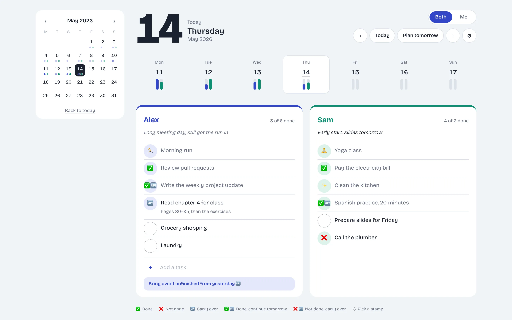
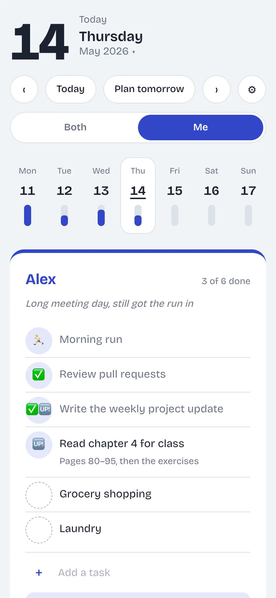

# Our Daily List

A shared daily to-do list for two people. Plan the day side by side, tick things off with a tap, and carry what's left into tomorrow.

  

## Features

- **Daily lists**: one page per day, with two lists side by side.
- **Status and stamps**: tap a task to cycle through done, not done and carry over, or mark it done with an emoji stamp.
- **Carry over and routines**: bring yesterday's unfinished tasks forward in one tap; daily routines are added to each new day.
- **Calendar**: a week strip and a month calendar show how much got done each day.
- **Both / Me**: show both lists, or focus on just yours.
- **Your list is yours**: you can edit only your own list; the other one is read-only.
- **PIN sign-in**: enter your email once per device, then just a 6-digit PIN.
- **Made for phones**: works on any screen size, in light and dark mode, and installs to the home screen.

## Built with

- Plain HTML, CSS and JavaScript (ES modules), with no framework and no build step
- GitHub Pages for hosting
- Firebase Authentication for sign-in and Cloud Firestore for real-time sync

Screenshots use sample data.
