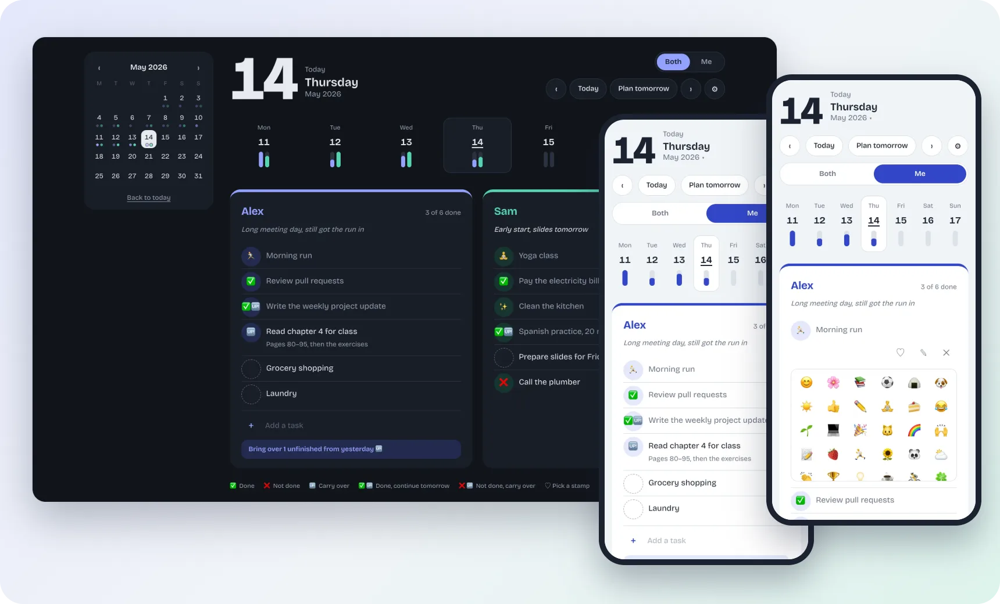

<p align="center">
  
</p>
<h1 align="center">Our Daily List</h1>
<p align="center">A shared daily to-do list, readable on a phone or a desktop.</p>

<p align="center">
  
</p>

## What it does

- Gives each day its own shared page, where every member has their own list.
- Tap a task to mark it done, not done or carry over, or pick an emoji stamp instead of a check mark.
- Brings yesterday's unfinished tasks into today in one tap, and adds your daily routines to each new day.
- Shows how much got done on each day in a week strip and a month calendar.
- Shows the whole shared page or just your own list with the Both / Me switch. You can edit only your own list.
- Signs in with an email once per device, then a 6-digit PIN. Changes appear on other devices right away.
- Works on any screen size, in light and dark mode, and installs to the home screen.

## How it works

```
this web app (static files on GitHub Pages) ──► Firebase Authentication (email + PIN)
        │
        ▼
    Firestore ◄──── live updates ────► other signed-in phones and desktops
    (one document per member per day; security rules let each member write only their own list)
```

This repository holds only the page code (HTML, CSS and JavaScript, no build step). Names,
tasks and routines live in Firestore, not in the code.

## Build your own

- **You need:** a GitHub account and a Firebase project (Authentication with email and password,
  and Firestore).
- **Rough path:** (1) create the Firebase project and add each member's account by hand; (2) put
  the project's web config in `config.js`; (3) write Firestore security rules that let only those
  accounts read the lists and each one write only their own; (4) publish the files with GitHub
  Pages.
- **Cost:** nothing; the Firebase and GitHub free tiers cover it.
- **Watch out for:** the Firebase web config is public by design, so the security rules are what
  keep the lists private; keep names, emails and routines out of the code and in Firestore; and
  browsers cache old files, so change the version in `app.js?v=N` whenever `app.js` changes.
- This project was written with an AI coding assistant, [Claude Code](https://claude.com/claude-code).

<sub>Screenshots use sample data.</sub>
